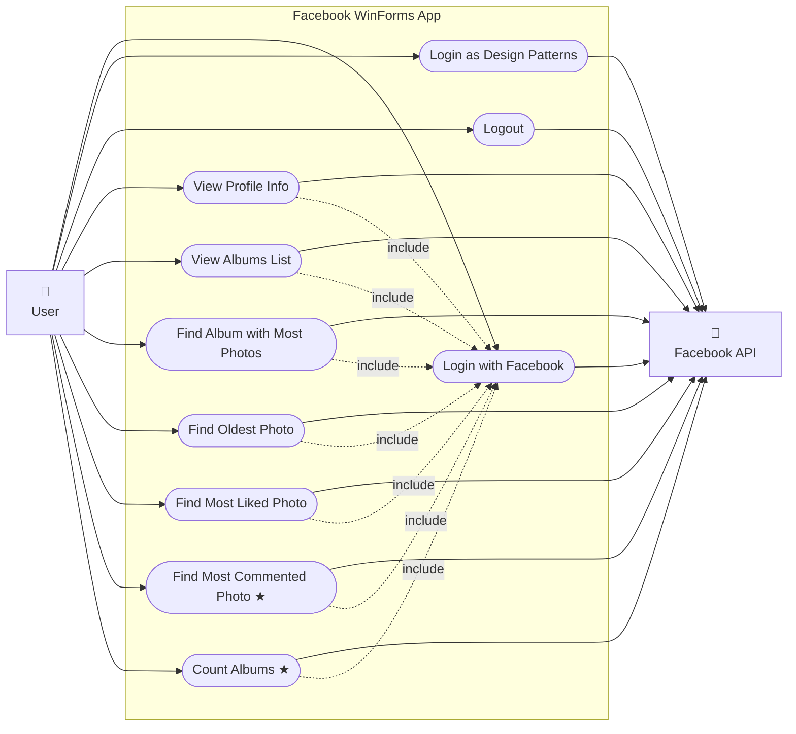
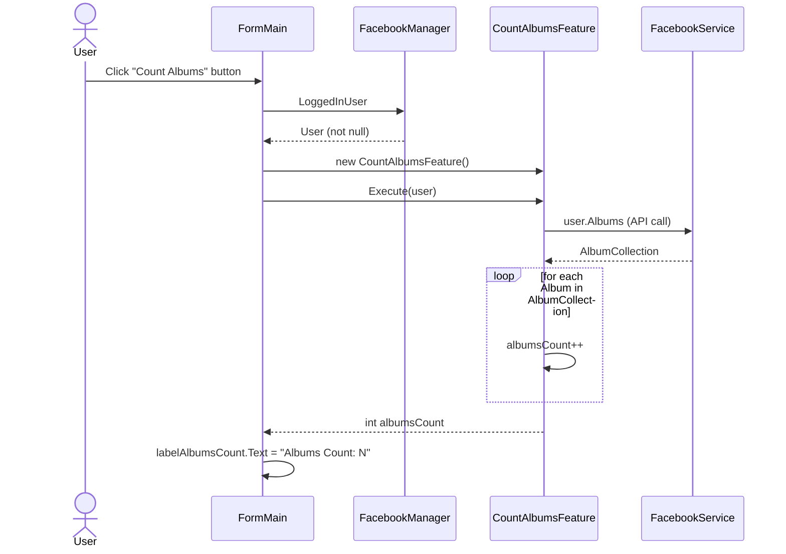
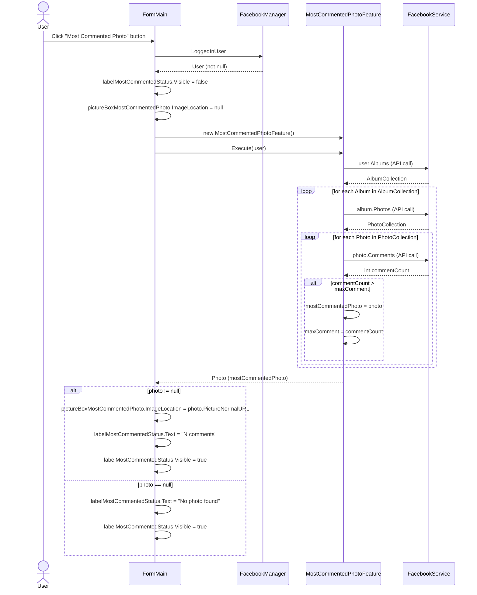
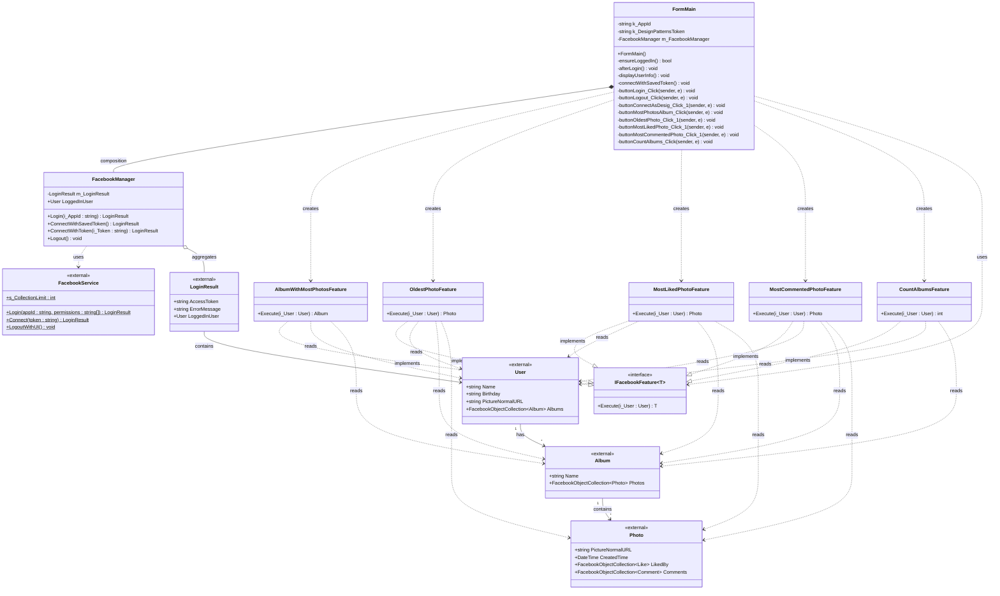

# UML Diagrams — Facebook WinForms App
### Lotem Kimchi 318173481 | Barak Braun 312143274

---

## א. Use Case Diagram

> ★ = New use case added in this submission

---

## ב. Sequence Diagram 1 — Count Albums (New Use Case)
> Most complex scenario: user is logged in and has albums

---

## ב. Sequence Diagram 2 — Most Commented Photo (New Use Case)
> Most complex scenario: user is logged in, has albums with photos that have comments

---

## ג. Class Diagram

